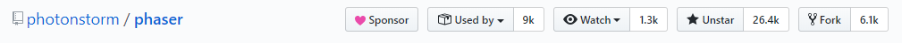
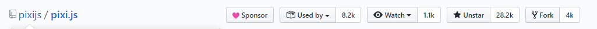
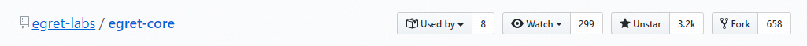
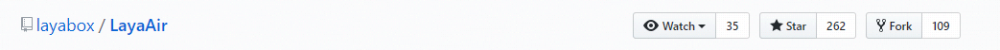

### 游戏引擎中文本实现方式

实现方式主要有以下两种
    
1. Canvas字体
    * 原理
        使用canvas的CanvasRenderingContext2D接口绘制文本然后作为纹理进行渲染文本
    * 实现方式
        * 从 HTMLCanvasElement 获取一个 CanvasRenderingContext2D
        * 使用 CanvasRenderingContext2D 提供的API绘制文本
            * 根据`文本样式`设置 CanvasRenderingContext2D 属性
            * 根据`文本样式`计算 绘制文字（文本）位置
            * 使用 [CanvasRenderingContext2D.strokeText](https://developer.mozilla.org/en-US/docs/Web/API/CanvasRenderingContext2D/strokeText) 或[CanvasRenderingContext2D.fillText](https://developer.mozilla.org/en-US/docs/Web/API/CanvasRenderingContext2D/fillText) 绘制文字（文本）
        * [可选] 使用 CanvasRenderingContext2D.getImageData 转换为 ImageData
        * 上传作为纹理使用
    * 优势
        * 完全利用原始API实现
        * 丰富的字体
        * 粗体
        * 斜体
        * 文本渐变
        * 描边
        * 阴影
    * 劣势
        * 平台支持 CanvasRenderingContext2D
        * 使用多个canvas

1. 位图字体
    * 原理
        使用事先准备好的`字符图集`作为纹理并修改网格数据绘制文本。
    * 实现过程
        * 使用工具生成出`特定字号特定字体`的`字符图集`与`描述文件`
        * 从绘制文本中获取`字符列表`与`描述文件`以及`文本样式`生成网格数据
        * 以`字符图集`作为纹理进行绘制
    * 优势
        * 不需要额外canvas，也不需要支持 CanvasRenderingContext2D
    * 劣势
        * 需要些额外shader代码
        * 不同字体甚至不同字号都需要有额外的`字符图集`与`描述文件`
        * 实现文本渐变，描边，阴影均需要额外的shader代码，甚至多次绘制
    * 参考资料
        * [BMFont (Windows, free)](http://www.angelcode.com/products/bmfont/)
        * [Glyph Designer (OS X, commercial)](http://www.71squared.com/en/glyphdesigner)
        * [Littera (Web-based, free)](http://kvazars.com/littera/)
    * 相关技术
        * SDF font 全称 signed distance field font 中文名称 有向距离场字体
            * 使用有向距离场技术来让文本渲染更加清晰的技术
            * 实现方式
                * 生成 SDF font 字符图集
                    * 拿到生成的`字符图集`与`描述文件`对每个字符做以下操作
                    * 对每个像素做周围半径`最大距离`像素遍历找到不同像素的最小距离作为像素值存储 [该过程`最大距离`越大所需时间呈平方增长！一般该操作使用工具操作。]
                * 在shader中根据位图数字判断文字边界进行绘制文本
            * 优势
                * 绘制出的文本更加清晰
                * shader中寻找文字边界使得制作描边更容易
                * 在缩小`字符图集`一定程度后依然可以保持清晰绘制
            * 劣势
                * 只支持纯黑白字体
                * 描边宽度限制在`最大距离`内
            * 相关资料
                * https://zhuanlan.zhihu.com/p/26217154
                * https://www.cnblogs.com/crazylights/p/5707081.html
                * https://www.cnblogs.com/crazylights/p/4320431.html

#### 

1. Canvas字体 [Text](https://github.com/photonstorm/phaser/blob/master/src/gameobjects/text/static/Text.js)
    * 在`1267`行使用接口 CanvasRenderingContext2D.fillText
    * 支持功能
        * 字体大小
        * 支持多种字体
        * 粗体
        * 斜体
        * 颜色
        * 描边
        * 对齐方式
1. 位图字体 [BitmapText](https://github.com/photonstorm/phaser/blob/master/src/gameobjects/bitmaptext/static/BitmapText.js)
    * [BitmapTextCanvasRenderer] (https://github.com/photonstorm/phaser/blob/master/src/gameobjects/bitmaptext/static/BitmapTextCanvasRenderer.js)
        * 在`168`行使用接口`CanvasRenderingContext2D.drawImage`绘制每个字符
    * [BitmapTextWebGLRenderer](https://github.com/photonstorm/phaser/blob/master/src/gameobjects/bitmaptext/static/BitmapTextWebGLRenderer.js)
        * 在`289`行使用内部接口 [TextureTintPipeline.batchQuad](https://github.com/photonstorm/phaser/blob/master/src/renderer/webgl/pipelines/TextureTintPipeline.js) 进行构造网格数据
    * 支持功能
        * 字体大小
        * 对齐方式

#### 

1. Canvas字体  [Text](https://github.com/pixijs/pixi.js/blob/dev/packages/text/src/Text.js)
    * 在`311`行使用接口 CanvasRenderingContext2D.fillText
    * 支持功能
        * 多种字体
        * 字体大小
        * 粗体
        * 斜体
        * 颜色
        * 描边
        * 阴影
        * 渐变
        * 自动换行
        * 对齐方式
1. 位图字体 [BitmapText](https://github.com/pixijs/pixi.js/blob/dev/packages/text-bitmap/src/BitmapText.js)
    * 在 BitmapText.updateText 中把每个字符拆分成sprite添加在BitmapText中。
    * 支持功能
        * 字体大小

#### 

1. Canvas字体 [TextField](https://github.com/egret-labs/egret-core/blob/master/src/egret/text/TextField.ts)
    * 在 TextField.drawText 函数内 调用 TextNode.drawText，最后在 CanvasRenderer.renderText 中调用 CanvasRenderingContext2D.fillText
    * 支持功能
        * 多种字体
        * 字体大小
        * 粗体
        * 斜体
        * 颜色
        * 描边
        * 对齐方式
1. 位图字体 [BitmapText](https://github.com/egret-labs/egret-core/blob/master/src/egret/text/BitmapText.ts)
    * 在 BitmapText.$updateRenderNode 中把每个字符拆分为 Texture 进行渲染
    * 支持功能
        * 对齐方式

#### 

1. Text Canvas字体 [Text](https://github.com/layabox/LayaAir/blob/master/src/layaAir/laya/display/Text.ts)
    * 在 Text._renderText 中进行每行调用 Graphics.fillText 绘制
    * 支持功能
        * 多种字体
        * 字体大小
        * 粗体
        * 斜体
        * 颜色
        * 对齐方式
1. Text 位图字体 
    * 在 Text._renderText 中根据 SpriteStyle 判断是否位图字体
    * 支持功能
        * 对齐方式

